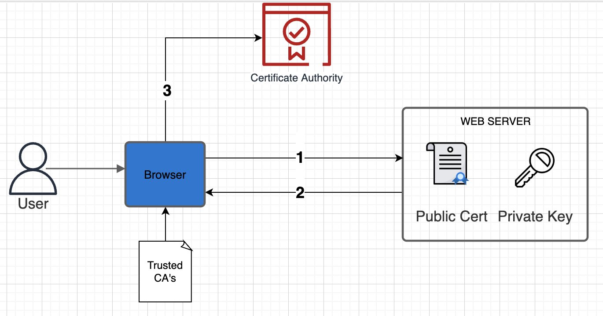
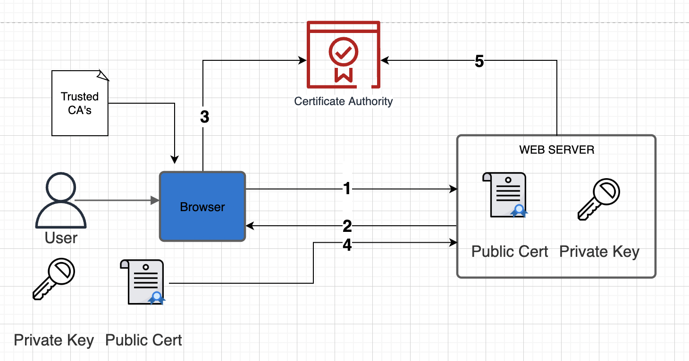

This repository explains how mTLS works on Istio service mesh.

First, we will see some concepts about TLS, mTLS, private keys, public keys and certificate authorities in the general aspect of kubernetes.

Then, a deep dive on mTLS applied to Istio.

## What is TLS ##

All communication between servers must be encrypted.

TLS is a protocol that aim to create a security session between client and servers, the principal components are:
1) Certificate authority
2) Private keys
3) Public keys
4) Public certificates

The first component that we will talk about is certificate autorithy.

Certificate authority is used to guarantee that when each server identify to another one with your public certificate, the server that receives the certificate can verify with the certificate authority if this public certificate is valid.

The CA authority have your own private and public key. 

Public keys and private keys are linked components, they are generated in a pair and are used together in transactions.

A key itself is just a piece of data with random number and letters.

When you request a sign certificate, the certificate authority uses your own private key to sign and send you back your public certificate, signed by the certificate. A public can be decrypted by anyone with access to the CA authority public key, that is available on the internet in your web browser.

When users try to access your domain, let's say for example www.test.com, the web server return the public certificate, signed by the certificate authority. Browsers automatically have a list of trusted certificate authorities, that are used on the background to perform a security check, before allow communication. Private companies could have your own certificate authorities, running inside their environment, or using cloud providers services like AWS ACM.

The public certificate from the web server was encrypted using the private key of the certificate authority.

So, that way, the client uses the public key of the certificate authority to verify the autenticity of the public certificate. If the certificate was not encrypted by a private key that maches your allowed certificate authorities, then that certificate isn't valid.

Now, we have already established that the web server is in fact owner of this domain, the client, sends to the server a new generated private key encrypted by the server public certificate. This way, the private key that the client sent, can only be decripted by the server private key.

In this step, we can see the following steps:
1. Client generates a private key
2. Client encrypts the private key with public key of the server
3. Client sends the private key encrypted with the public key to the web server
4. Server decrypt and stores the client private key.

The server can decrypt the private key of the client, since it were encrypted with our own public key. Now, both server and client have a copy of the private key generated by the client.

All the keys that we talked about until now works like this:
1. Public key/certificate encrypts the data
2. Private key decrypt the data.

This type of key is knowed as assymetric keys. Using assymetric keys, data encrypted by one of the pair can only be decrypted by the another one.

The type of the key generated by the client to  the server in this step, is a symmetric key. Symmetric keys works straightly different from symmetric keys: data can be encrypted/decrypted by the same key. This type of key is commonly used after we already have a security connection established.

This is the overall proccess of how TLS works, but, this workflow is about two things: validation of the server identity: the server public certificate is signed by a valid certificate authority for your browser? And creation of a securely session between client and server. But what about the client validation? The client really is who it say?

## Introduction of mTLS ##

mTLS is a protocol that allows servers to validate clients, instead of only client validating server. Since we already know how TLS works, it's very simple to extend that to mTLS.

With the certificate autority in place, the client generate a certificate sign request to the CA and the CA return a public certificate, signed by your own private key, and during the TLS protocol, it adds the exchange of this public certificate, from the client to the server. The server decrypts the public certificate using CA public key and verifies that is valid. This way, both server and client know who is each other.

